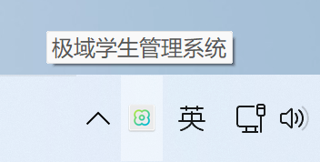
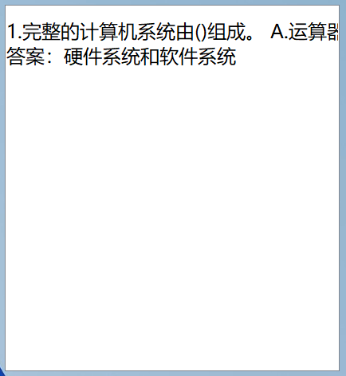
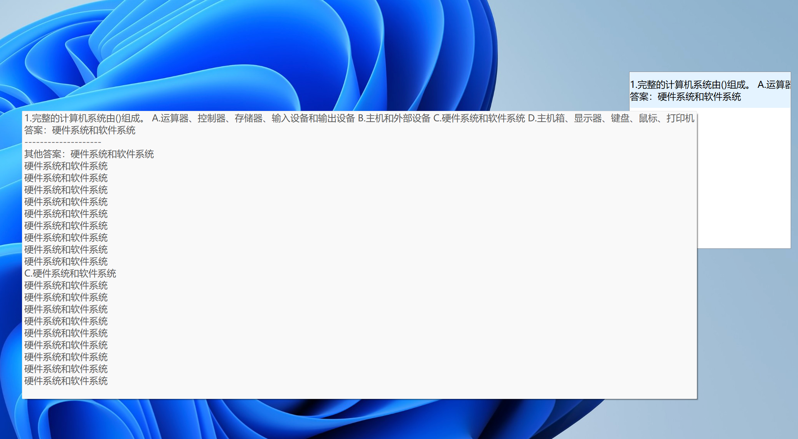

# OneClickQuery  

# 一键OCR识图搜题

本项目是基于Python开发的，使用的依赖库**只适用于windows平台**，在其他平台可能会导致无法正常使用

**适用于win7及以上版本**

## 如何使用

**Python版本 3.8**

### 1. 在代码中填写api_key

本项目使用如下api服务

- [百度OCR](https://ai.baidu.com/tech/ocr)：每月免费1000次调用，使用通用场景文字识别，请在main/BaiduOCR.py中填写API_KEY 和 SECRET_KEY
- [题海题库](https://console-docs.apipost.cn/preview/d2f2cd5aa0447504/553c33c1377c4e44?target_id=60e0b1b4-cbc7-4698-8d61-89273ae7050b)：请在main/main.py中第136行填写tk_token
- OpenAI接口：本项目使用的是 https://home.nextapi.fun 提供的中转服务，可自行在107 108行填写修改api地址和api_key

### 2. 安装依赖

```powershell
pip install -r requirements.txt
```

### 3. 打包程序

```powershell
$Env:SITE_PACKAGES_PATH = python -c "import site; print(site.getsitepackages()[0])"
pyinstaller --onefile --add-data "main/OneClickQuery.ico;." --add-data "main/active.ico;." --noconsole --name "JYdianzijiaoshi" -i main/OneClickQuery.ico main/main.py -p $Env:SITE_PACKAGES_PATH
```

打包后的exe位于dist目录下

### 4. 使用说明

启动后会在任务栏显示“极域学生管理系统”名称的托盘，使用这个名字和图标是为了在考试时伪装



右键单击托盘图标会显示如下选项

- 举手：启动截图搜题主函数，快捷键（**ctrl+Q**）
- 联系老师：更换搜题模式 题库/ChatGPT
- 关于：退出程序

#### 搜题主函数

1. 调用后鼠标会变成十字键，单击鼠标或按下ESC键可以取消，截图后等待托盘图标颜色变为如下图颜色，即代表搜题完成


1. 使用快捷键 **ctrl+~** 显示结果窗口，单击窗口外或单击窗口可关闭窗口



​	默认会将出现次数最多的答案显示在结果项目中，鼠标放在结果项目上可显示所有搜到的答案



**注意：截图和结果窗口不能同时调用，在打开结果窗口时按下截图快捷键是无效的，必须先关闭结果窗口**

3. 如果结果报错“程序错误，请重试”，一般为网络问题，请检查系统是否使用了代理程序。